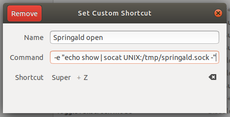

# springald

Springald is a simple launcher, similar to Launchy. It is written in _vanilla-js™_ and
uses the nwjs framework.

It can parse a fluxbox menu file, read directories from path or from a config file,
can launch .desktop files.

## Installation, launching

Download and extract the [nwjs](https://nwjs.io/) sdk,
then symlink the executable to your path.
Then download springald:

1. `cd ~/bin`
2. `git clone https://github.com/szkrd/springald.git`
3. `cd springald`
4. `npm ci`
5. `nw .`

See `config.json` for available settings.

By default
_Esc_ hides,
_ctrl + q_ quits,
_mod4 + q_ toggles,
_F5_ reparses.

## Overrides

* config: create a `~/.config/springald/config.json` file. ([options](./config.json))
* supported themes so far: _default_, _ambiance_
* styles: create a `~/.config/springald/override.css` file. ([variables](./styles/variables.css), [more](./styles/springald.css))

On OSX and Windows these are [elsewhere](http://docs.nwjs.io/en/latest/References/App/#appdatapath).

Config override does a shallow merge only. If you know what you're doing and you find this a problem then probably you're better off modifying the `config.json` itself in the app and stash+pull+pop upgrade manually.

## Borderless window

If you want to remove the window decorations then replace `"frame": true`
with `"frame": false` in the `package.json` file. This is not an overridable
flag, it must be set before the app startup.

Another option is to force fluxbox to remove the decorations himself.

## Open with

Press _Tab_ to focus on the second (rightmost) input field,
you can use it to enter simple executable names. Press enter
to finish the autocomplete, enter `F` (configurable) to open
in the shell's default folder viewer.

## Linux IPC

On linux it's possible to remotely control the app via unix sockets
(the default socket is `/tmp/springald.sock`, see config.json).

- Commands: `show`, `hide`, `toggle`, `close`, `reload`, `quit`
- Example: `echo "show" | socat UNIX:/tmp/springald.sock -`

## Known issues

Non utf-8 filenames may not work, this is especially a problem on Unices.

## Debugging, development

See also the [README in docs](./docs/README.md)

## Using with Gnome Desktop / Ubuntu

In gnome the global registered toggle key [may not work](https://github.com/nwjs/nw.js/issues/6228), in that case you can use the socket fallback below:

- install _socat_ and _xterm_ (`sudo apt install socat xterm`)
- set a keyboard shortcut for the command `xterm -e "echo show | socat UNIX:/tmp/springald.sock -"`

