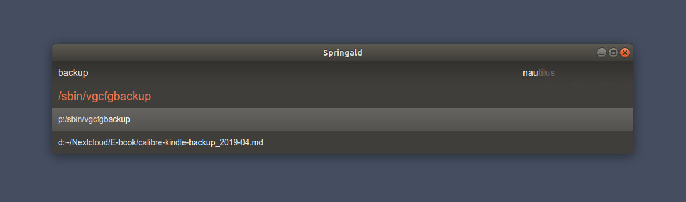

# springald

Springald is a simple launcher, similar to Launchy. It is written in _vanilla-js™_
uses no dependencies apart from  ~~nwjs~~ electron.

It can parse a fluxbox menu file, read directories from path or from a config file,
can launch .desktop files. That's it.

This is a rather messy tool, you probably need something more robust, like
[Albert](https://github.com/albertlauncher/albert),
[ULauncher](https://github.com/Ulauncher/Ulauncher/),
[Rofi](https://github.com/davatorium/rofi),
[Launchy](https://www.launchy.net/index.php)
etc.

## usage

The app is not bundled. Use node.

For options see [config.json](./config.json); you can shallow override them
with a `~/.config/springald/config.json` file.

Shortcuts:

- _Esc_ = hide
- (_ctrl + q_ = quit)
- _mod4 + a_ = toggle
- _F5_ = reparse
- _alt + c_ = center on screen
- _ctrl + c_ = clear inputs
- _F12_ = toggle dev toolbar
- _tab_ = toggle between the two inputs (path left, open with app right)

## development

If you are _me_ and you (I) haven't touched this project in a while, then you might be wondering what is this mess. Dear me, please read your notes in the [docs](./docs/dev.md) folder.
