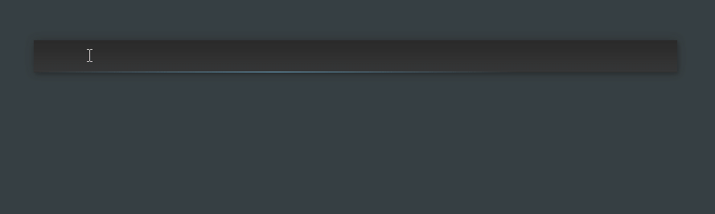

# springald

Springald is a simple launcher, similar to Launchy. It is written in _vanilla-js™_
uses no dependencies apart from ~~nwjs~~ electron.

It can parse a fluxbox menu file, read directories from path or from a config file,
can launch .desktop files. That's it.

Ambience theme:

Aquamint theme:

This is a rather messy tool, you probably need something more robust, like
[Albert](https://github.com/albertlauncher/albert),
[ULauncher](https://github.com/Ulauncher/Ulauncher/),
[Rofi](https://github.com/davatorium/rofi),
[Launchy](https://www.launchy.net/index.php)
etc.

## usage

The app is not bundled. Use node:

1. `npm i`
2. `npm start` (or use `launcher.sh` or `launcher.vbs`)

For options see [config.json](./config.json) and [docs](./docs/config.md);
you can **shallow override** them with a local config:

- linux: `~/.config/springald/config.json`
- windows: `C:\Users\%USERNAME%\AppData\Roaming\springald\config.json`
- mac: `~/Library/Application Support/springald\config.json`
- or in the application dir: `./config.local.json`

### shortcuts

- _Esc_ = hide
- _ctrl + q_ / _ctrl + w_ = quit
- _F5_ = reparse
- _alt + c_ = center on screen
- _ctrl + c_ = clear inputs
- _F12_ = toggle dev toolbar
- _shift + F12_ = dump both backend and renderer logs to console
- _tab_ = toggle between the two inputs (path left, open with app right)

Global shortcut toggle by default is `logo key + backtick` (and `ctrl + shift + alt + backtick`)
be sure to set an override in your user config, string for single key, array for multiple keys.

Available global electron shortcuts are [here](https://www.electronjs.org/docs/api/accelerator),
modifiers are `Cmd`, `Ctrl`, `CmdOrCtrl`, `Alt`, `Option`, `AltGr`, `Shift`, `Super`.

If your linux desktop environment has problems with electron global keys, you can use
the `/tmp/springald.sock` **unix socket** to toggle the instance (either through `launcher.sh`
or by directly sending a message with [socat](https://linux.die.net/man/1/socat):
`echo toggle | socat UNIX:/tmp/springald.sock -`);
for details see [unixSocket.js](./src/backend//modules/unixSocket.js).

## development

If you are _me_ and you (I) haven't touched this project in a while, then you might be wondering what is this mess.
Dear me, please read your notes in the [docs](./docs/dev.md) folder.

Other than that, `npm run dev` from the console.

Notable entry points:

1. [backend.js](./src/backend/backend.js) via [package.json](./package.json)
2. ([interim.js](./src/interim/interim.js) via [index.html](./index.html))
3. [renderer.js](./src/renderer/renderer.js) via [index.html](./index.html)

### vscode

Available tasks: **lint** (as build, use `ctrl + shift + b`), **lint:fix**.

## notes

### win

- create a user config to override defaults
- use `"borderlessWindow": true` on windows to fix the height calculation
- files in `C:\WINDOWS*` are skipped
- launch in terminal is kinda pointless

### linux

- use `trayIconSize: 'large'` if your tray supports hires icons
- the tray tooltip may or may not work (see: https://github.com/electron/electron/issues/28131)
- use `fixPosition` and `modifyResize` to fix window size problems
- if the global `toggleKey` misbehaves, you will have to fall back to unix sockets
- gnome/cinnamon:
  - you can create a keyboard shortcut for a launcher, in the launcher
    use the full path to the shellscript (or if you symlinked it into `~/bin/springald`
    you will still need to use the full path: `/home/johndoe/bin/springald`)
  - if you want only a toggle, then the launcher must first launch bash:  
    `bash -c 'echo toggle | socat UNIX:/tmp/springald.sock -'`
  - the same is true for the "create a new launcher" feature
    (and then the launcher can be added to the autolaunch items)

### TODO

- [ ] add proper `.desktop` file support (`gtk-launch` is a workaround for now)?
- [ ] list uwp apps (see EPERM part in `parsePath.js`)?
