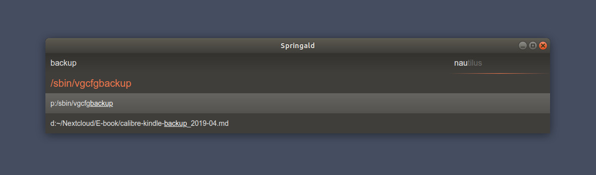
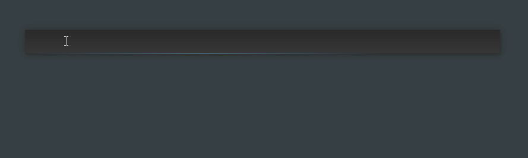

# springald

Springald is a simple launcher, similar to Launchy.
It was rewritten in typescript and it uses no runtime dependencies apart from electron.

It can parse a fluxbox menu file, read directories from path or from a config file,
can launch .desktop files. That's it.

This is a rather messy tool, you probably need something more robust, but it works for me;
as of this writing (2026 March) I still use it on a daily basis.

## themes

Ambience:

Aquamint:

## usage

The app is not bundled. Use node:

1. `npm ci`
2. `npm run build`
3. `npm start` (or use `launcher.sh` or `launcher.vbs`)

For options see [config.json](./config.json) and [type definition](./src/shared/config.types.ts);
you can **shallow override** them with a local config:

- linux: `~/.config/springald/config.json`
- windows: `C:\Users\%USERNAME%\AppData\Roaming\springald\config.json`
- mac: `~/Library/Application Support/springald\config.json`
- or in the application dir: `./config.local.json`

### shortcuts

- _Esc_ = hide
- _ctrl + q_ / _ctrl + w_ = quit
- _F5_ = reparse
- _alt + c_ = center on screen
- _ctrl + c_ = clear inputs
- _alt + m_ = log memory usage to console
- _F12_ = toggle dev toolbar
- _shift + F12_ = dump both backend and renderer logs to console
- _tab_ = toggle between the two inputs (path left, open with app right)

Global shortcut toggle by default is `logo key + backtick` (and `ctrl + shift + alt + backtick`)
be sure to set an override in your user config, string for single key, array for multiple keys.

If your linux desktop environment has problems with electron global keys, you can use
the `/tmp/springald.sock` **unix socket** to toggle the instance (either through `launcher.sh`
or by directly sending a message with [socat](https://linux.die.net/man/1/socat):
`echo toggle | socat UNIX:/tmp/springald.sock -`);
for details see [unixSocket.js](./src/backend/messaging/unixSocket.ts).

## development

If you are _me_ and you (I) haven't touched this project in a while, then you might be wondering what is this mess.
Dear me, please read your notes in the [docs](./docs/dev.md) folder.

Other than that, `npm ci`, `npm run watch` (for ts to js transpilation) and then `npm run dev` from the console.

Notable entry points:

1. [backend](./src/backend/backend.ts) via [package.json](./package.json)
2. [main](./src/main.ts) via [index.html](./index.html)

## notes

### win

- create a user config to override defaults
- please always use `"borderlessWindow": true` on Windows to fix the broken height calculation
- files in `C:\WINDOWS*` are skipped
- launch in terminal is kinda pointless

### linux

- use `trayIconSize: 'large'` if your tray supports hires icons
- the tray tooltip may or may not work (see: https://github.com/electron/electron/issues/28131)
- use `fixPosition` and `modifyResize` to fix window size problems
- if the global `toggleKey` misbehaves, you will have to fall back to unix sockets
- gnome/cinnamon:
  - you can create a keyboard shortcut for a launcher, in the launcher
    use the full path to the shellscript (or if you symlinked it into `~/bin/springald`
    you will still need to use the full path: `/home/johndoe/bin/springald`)
  - if you want only a toggle, then the launcher must first launch bash:  
    `bash -c 'echo toggle | socat UNIX:/tmp/springald.sock -'`
  - the same is true for the "create a new launcher" feature
    (and then the launcher can be added to the autolaunch items)
